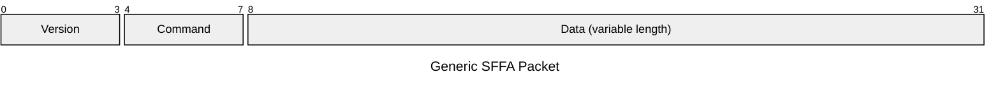
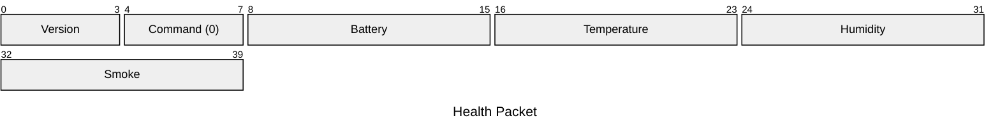
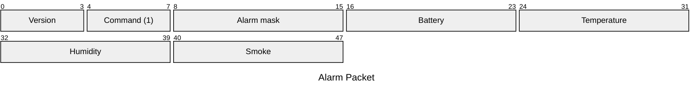
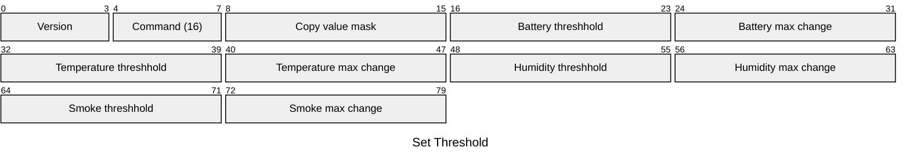

Current version: 1

Commands:
- Health: 0
- Alarm: 1
- Set Threshold: 16
- Set Period: 17
- Reset Alarm: 18

```mermaid
---
title: "Generic SFFA Packet"
---
packet
0-3: "Version"
4-7: "Command"
8-31: "Data (variable length)"
```

```mermaid
---
title: "Health Packet"
---
packet
0-3: "Version"
4-7: "Command (0)"
+8: "Battery"
+8: "Temperature"
+8: "Humidity"
+8: "Smoke"
```

```mermaid
---
title: "Alarm Packet"
---
packet
0-3: "Version"
4-7: "Command (1)"
+8: "Alarm mask"
+8: "Battery"
+8: "Temperature"
+8: "Humidity"
+8: "Smoke"
```

```mermaid
---
title: "Set Threshold"
---
packet
0-3: "Version"
4-7: "Command (16)"
+8: "Copy value mask"
+8: "Battery threshhold"
+8: "Battery max change"
+8: "Temperature threshhold"
+8: "Temperature max change"
+8: "Humidity threshhold"
+8: "Humidity max change"
+8: "Smoke threshhold"
+8: "Smoke max change"
```

