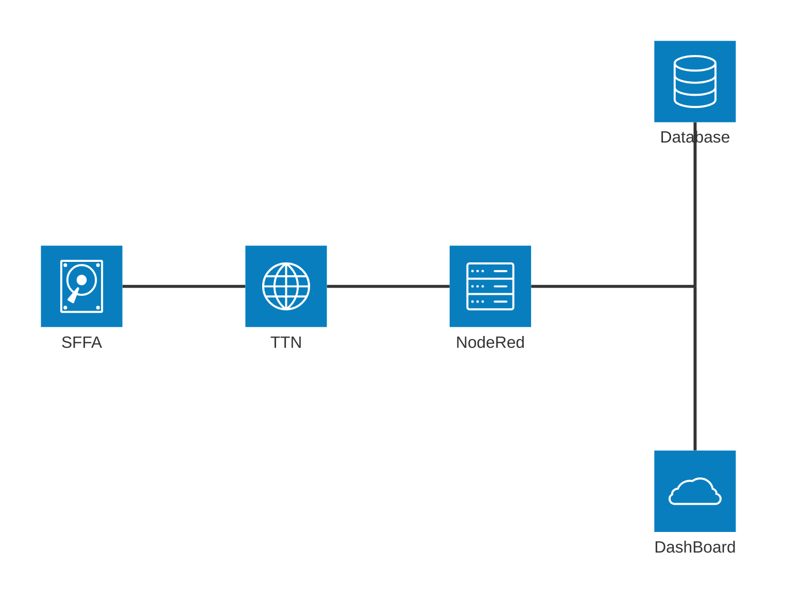
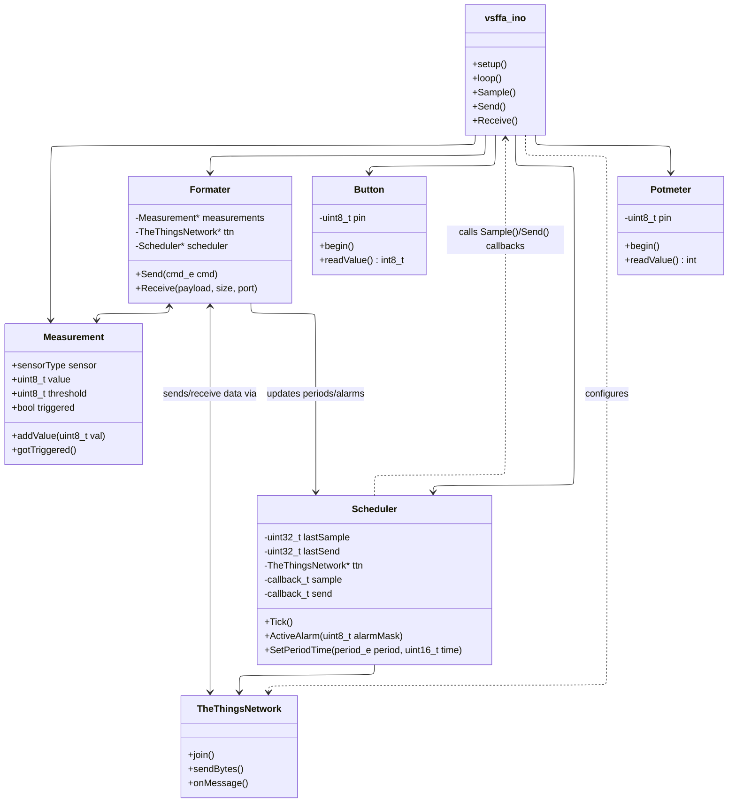
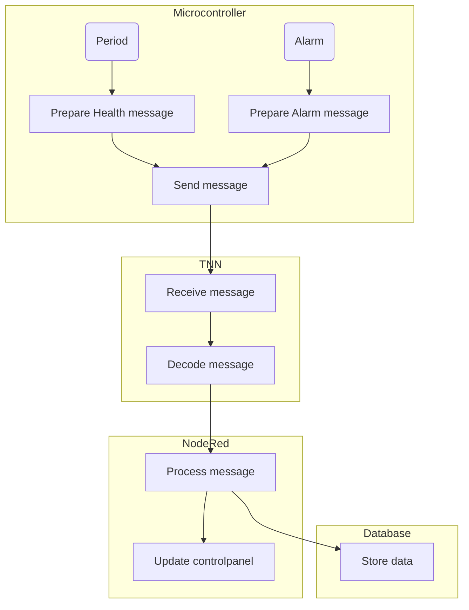
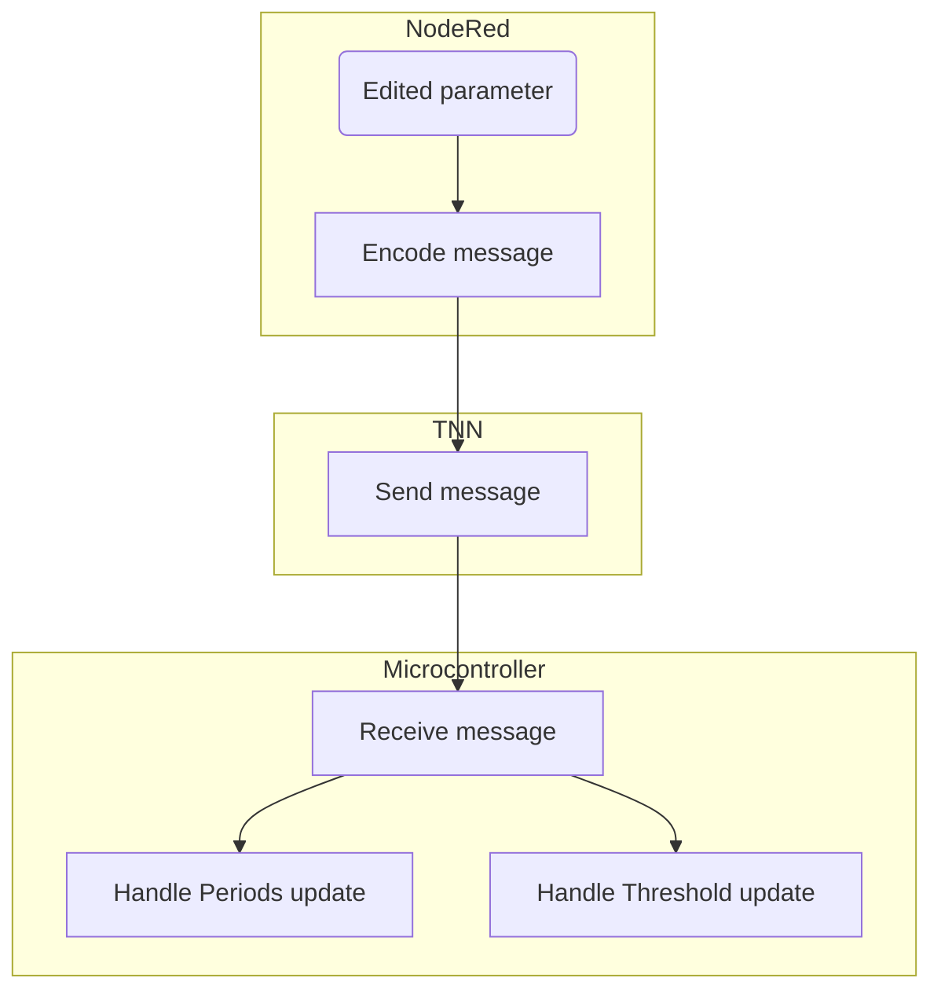
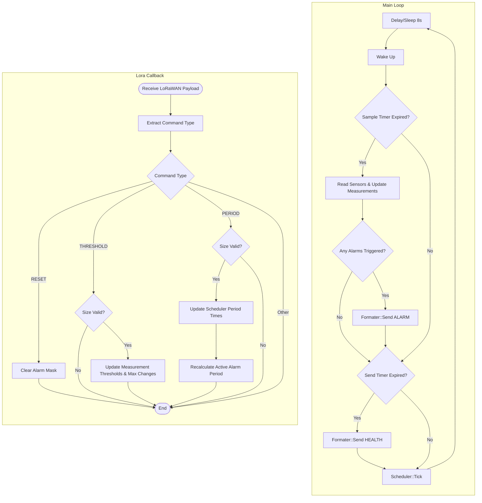

```mermaid
architecture-beta
    service db(database)[Database]
    service dash(cloud)[DashBoard]
    service nodered(server)[NodeRed]
    service network(internet)[TTN]
    service micro(disk)[SFFA]
    junction dbJ
    
    db:B--T:dbJ
    dbJ:B -- T:dash
    dbJ:L -- R:nodered
    %% nodered:T -- L:dash
    nodered:L -- R:network
    network:L -- R:micro
```

```mermaid
---
config:
  layout: elk
---
classDiagram
direction TB
    class vsffa_ino {
	    +setup()
	    +loop()
	    +Sample()
	    +Send()
	    +Receive()
    }

    class Scheduler {
	    -uint32_t lastSample
	    -uint32_t lastSend
	    -TheThingsNetwork* ttn
	    -callback_t sample
	    -callback_t send
	    +Tick()
	    +ActiveAlarm(uint8_t alarmMask)
	    +SetPeriodTime(period_e period, uint16_t time)
    }

    class Formater {
	    -Measurement* measurements
	    -TheThingsNetwork* ttn
	    -Scheduler* scheduler
	    +Send(cmd_e cmd)
	    +Receive(payload, size, port)
    }

    class Measurement {
	    +sensorType sensor
	    +uint8_t value
	    +uint8_t threshold
	    +bool triggered
	    +addValue(uint8_t val)
	    +gotTriggered()
    }

    class Button {
	    -uint8_t pin
	    +begin()
	    +readValue() int8_t
    }

    class Potmeter {
	    -uint8_t pin
	    +begin()
	    +readValue() int
    }

    class TheThingsNetwork {
	    +join()
	    +sendBytes()
	    +onMessage()
    }

    vsffa_ino --> Scheduler
    vsffa_ino --> Formater
    vsffa_ino --> Button
    vsffa_ino --> Potmeter
    vsffa_ino ..> TheThingsNetwork : configures
    Scheduler --> TheThingsNetwork
    Scheduler ..> vsffa_ino : calls Sample()/Send() callbacks
    Formater <--> Measurement
    Formater <--> TheThingsNetwork : sends/receive data via
    Formater --> Scheduler : updates periods/alarms
    vsffa_ino --> Measurement
```

```mermaid
---
config:
  layout: dagre
---
flowchart TB
 subgraph subGraph0["Microcontroller"]
        n2["Prepare Health message"]
        n1["Period"]
        n3["Send message"]
        n5["Prepare Alarm message"]
        n4["Alarm"]
  end
 subgraph subGraph1["TNN"]
        n6["Receive message"]
        n7["Decode message"]
  end
 subgraph NodeRed["NodeRed"]
        n8["Process message"]
        n9["Update controlpanel"]
  end
subgraph database["Database"]
    n8 --> n9 & n10["Store data"]
end
    n1 --> n2
    n2 --> n3
    n4 --> n5
    n5 --> n3
    n3 --> n6
    n6 --> n7
    n7 --> n8

    n1@{ shape: rounded}
    n4@{ shape: rounded}
    n6@{ shape: rect}
    n7@{ shape: rect}
    n9@{ shape: rect}
```

```mermaid
---
config:
  layout: dagre
---
flowchart TB
 subgraph subGraph0["Microcontroller"]
        n10["Receive message"]
        n11["Handle Periods update"]
        n12["Handle Threshold update"]
  end
 subgraph subGraph1["TNN"]
        n6["Send message"]
  end
 subgraph NodeRed["NodeRed"]
        n8["Encode message"]
        n9["Edited parameter"]
  end
    n9 --> n8
    n8 --> n6
    n6 --> n10
    n10 --> n11 & n12

    n9@{ shape: rounded}
```

```mermaid
---
config:
  layout: dagre
---
flowchart BT
 subgraph subGraph0["Main Loop"]
        Sleep["Delay/Sleep 8s"]
        Loop["Scheduler::Tick"]
        Wake["Wake Up"]
        CheckSample{"Sample Timer Expired?"}
        Sample["Read Sensors & Update Measurements"]
        CheckAlarm{"Any Alarms Triggered?"}
        SendAlarm["Formater::Send ALARM"]
        CheckSend{"Send Timer Expired?"}
        SendHealth["Formater::Send HEALTH"]
  end
 subgraph subGraph1["Lora Callback"]
        ParseCmd["Extract Command Type"]
        Recv(["Receive LoRaWAN Payload"])
        Switch{"Command Type"}
        Reset["Clear Alarm Mask"]
        End(["End"])
        CheckThresh{"Size Valid?"}
        UpdateThresh["Update Measurement Thresholds & Max Changes"]
        CheckPeriod{"Size Valid?"}
        UpdatePeriod["Update Scheduler Period Times"]
        RefreshAlarm["Recalculate Active Alarm Period"]
  end
    Loop --> Sleep
    Sleep --> Wake
    Wake --> CheckSample
    CheckSample -- Yes --> Sample
    Sample --> CheckAlarm
    CheckAlarm -- Yes --> SendAlarm
    CheckAlarm -- No --> CheckSend
    SendAlarm --> CheckSend
    CheckSample -- No --> CheckSend
    CheckSend -- Yes --> SendHealth
    SendHealth --> Loop
    CheckSend -- No --> Loop
    Recv --> ParseCmd
    ParseCmd --> Switch
    Switch -- RESET --> Reset
    Reset --> End
    Switch -- THRESHOLD --> CheckThresh
    CheckThresh -- Yes --> UpdateThresh
    CheckThresh -- No --> End
    UpdateThresh --> End
    Switch -- PERIOD --> CheckPeriod
    CheckPeriod -- Yes --> UpdatePeriod
    UpdatePeriod --> RefreshAlarm
    RefreshAlarm --> End
    CheckPeriod -- No --> End
    Switch -- Other --> End
```

